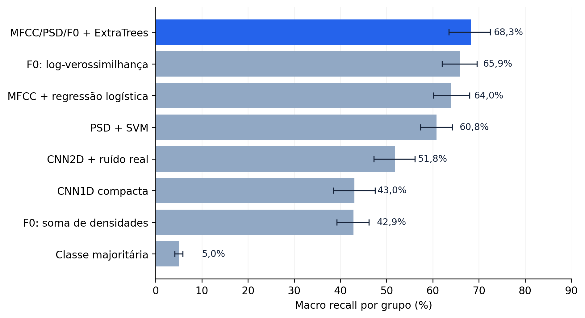
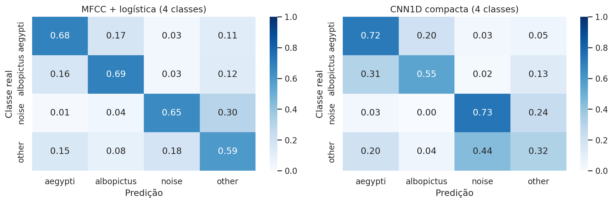
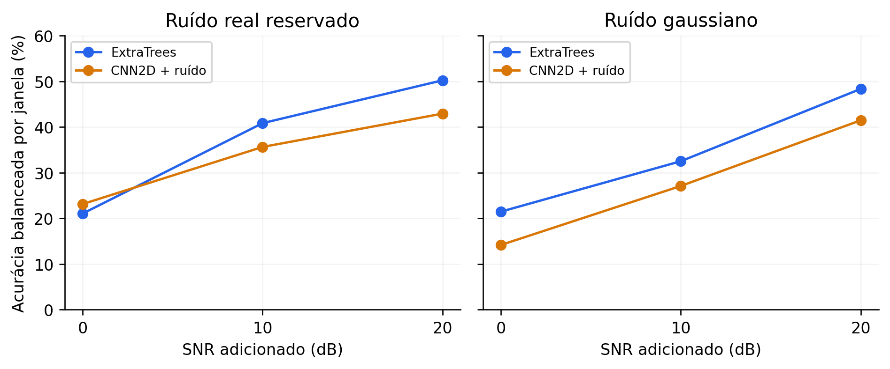

# Classificação acústica de mosquitos

Relatório técnico de métodos, resultados, explicabilidade e comparação com a literatura

Emitido em 29/09/2026. Execução analisada: 2026-09-29. Projeto: mosquito-wingbeat. Idioma: português.

### Resumo executivo

O estudo reúne a leitura de três artigos, o download completo de um acervo de celulares e a comparação de oito classificadores. O benchmark principal inclui **20 espécies, 23.877 janelas de um segundo e 569 grupos**. As janelas de um mesmo grupo são reservadas juntas na avaliação.

O melhor resultado observado foi **MFCC/PSD/F0 + ExtraTrees**, com **48,9% de acurácia balanceada por janela** e **68,3% de macro recall por grupo**. O intervalo bootstrap descritivo por grupo foi 63,5% a 72,4%. As CNNs compactas testadas ficaram abaixo desse resultado no benchmark principal.

| Questão | Conclusão sustentada |
| --- | --- |
| Outros métodos melhoraram a classificação? | Sim, no protocolo local. ExtraTrees teve o maior resultado observado. |
| Houve comparação com redes neurais? | Sim. CNN1D, CNN2D com ruído e uma tarefa TinyML de quatro classes. |
| Existe explicabilidade? | Parcial: sinais, sobreposição, erros e sensibilidade. Faltam atribuições das decisões. |
| O estudo superou os artigos? | Superioridade não demonstrada. Dados, métricas e protocolos diferem. |

Este documento sintetiza experimentos já executados. A geração do relatório não treinou novos modelos; recalculou as métricas salvas para conferir a consistência dos números.

Repositório: [Lciarallo/mosquito-wingbeat](https://github.com/Lciarallo/mosquito-wingbeat).

## 1. Dados, origem e auditoria

O corpus principal corresponde ao DOI **10.5061/dryad.98d7s**, associado ao trabalho de Mukundarajan et al. [1]. Foram baixados os 20 arquivos RAR completos. As rotas automáticas do Dryad recusaram o download; foi utilizado o espelho Zenodo 4964774 do mesmo DOI. Nomes, tamanhos e MD5 foram comparados com os metadados oficiais Dryad; também foram calculados SHA-256 [2].

| Item | Valor verificado |
| --- | --- |
| Arquivos compactados | 20 de 20 íntegros |
| Volume compactado | 1.232.964.187 bytes (1,233 GB decimais) |
| Arquivos inventariados | 1.537 |
| Arquivos candidatos após auditoria | 820 |
| Janelas analisadas, incluindo ruído | 24.405 |
| Benchmark de espécies | 23.877 janelas / 569 grupos |
| Classe de ruído | 528 janelas / 44 grupos de fontes |

### Regras de exclusão de arquivos

| Categoria | Arquivos |
| --- | --- |
| Incluídos como candidatos | 820 |
| A. sierrensis fora do recorte curado / cópias | 326 |
| Original comprimido com WAV correspondente | 203 |
| Duplicatas exatas | 64 |
| Arquivos sem áudio | 63 |
| Áudio com duração menor que 1 s | 50 |
| Recortes derivados sem relação suficientemente mapeada | 9 |
| Conteúdo idêntico com rótulos conflitantes | 2 |

Na etapa de janelas, 67 trechos duplicados ou conflitantes foram removidos e foi identificada uma forma de onda com rótulos conflitantes. Grupos com formas de onda idênticas verificáveis foram conectados antes da divisão. As regras reduzem repetições conhecidas, sem garantir independência entre indivíduo, colônia ou sessão.

Ruídos complementares vieram do repositório dos autores TinyML [3], com commit e SHA-256 fixados. Os rótulos de espécie vêm do acervo; não houve anotação independente da atividade de mosquito em cada segundo. Arquivos e rótulos de ruído também podem ocorrer no corpus original.

## 2. Pré-processamento e representações

A preparação padroniza formatos e escalas, preservando uma faixa espectral compatível com gravações antigas a 8 kHz. Reamostrar para 16 kHz não cria informação acima da frequência originalmente capturada. O processo não aplica um algoritmo avançado de remoção de ruído.

| Etapa | Implementação |
| --- | --- |
| Leitura / conversão | SoundFile; ffmpeg como alternativa para formatos não decodificados diretamente. |
| Canais e taxa | Média dos canais para mono; reamostragem polifásica com antialiasing quando necessário, alvo 16 kHz. |
| Segmentação | Janelas de 1 s sem sobreposição; até 60 por arquivo, distribuídas ao longo da gravação. |
| Amplitude | Remoção da média (DC) e normalização RMS; descarte de janelas praticamente silenciosas. |
| Integridade | Verificação de valores finitos, hashes e relações de repetição verificáveis. |

### Características extraídas

| Representação | Informação utilizada |
| --- | --- |
| MFCC | Média e desvio de 13 coeficientes: 26 características da distribuição espectral. |
| PSD de Welch | Potência em escala logarítmica; 77 posições de 150 a 3.950 Hz, passo de 50 Hz. |
| Frequência / harmônicos | Histogramas de picos de 200 a 900 Hz; mediana, dispersão, quantis e escore harmônico. |
| Resumo espectral | Centroide, planicidade e entropia, além das estimativas de frequência. |
| Espectrograma Mel | 40 bandas entre 100 e 3.900 Hz; FFT de 512 amostras e avanço de 256 (32/16 ms). |

A representação combinada contém 112 características. A estimativa chamada F0 no código é uma aproximação baseada em picos/harmônicos; não constitui uma medição independente da frequência fundamental física em todo trecho.

O ganho apresentado adiante pertence à combinação entre representação, modelo e protocolo. Não foi feita uma ablação controlada para medir separadamente o efeito de normalização, remoção de DC, faixa espectral ou cada família de características.

## 3. Avaliação e definição das métricas

A avaliação principal usa três dobras estratificadas na tabela de grupos, com todas as espécies presentes em treino e teste. Grupos são definidos por hashes/relações de conteúdo verificáveis; trechos das fontes de ruído ficam juntos. São verificadas as separações por grupo e por forma de onda idêntica. Isso não equivale a reservar automaticamente toda uma colônia ou população.

- As previsões fora da dobra são reunidas para calcular os resultados finais; as janelas de teste não treinam seu modelo.
- Padronização das características dos modelos lineares é ajustada somente no treino.
- Pesos por espécie e grupo reduzem a dominância de classes frequentes e gravações longas. Nas CNNs, amostragem ponderada implementa esse balanceamento.
- As CNNs reservam grupos de validação dentro do treino externo e selecionam checkpoints pela perda de validação, com até 25 épocas e paciência de 5.
- A semente é 42. As solicitações de determinismo não garantem identidade bit a bit em todos os kernels GPU.

| Métrica | Definição e interpretação |
| --- | --- |
| Acurácia geral por janela | Fração de trechos corretamente classificados; pode ser dominada por classes mais frequentes. |
| Acurácia balanceada por janela | Média do recall das espécies, dando peso igual a cada espécie. |
| Macro F1 por janela | Média do F1 das espécies, combinando precisão e recall. |
| Macro recall por grupo | Média dos escores das janelas em cada grupo, escolha da classe e média do recall entre espécies. |
| Intervalo bootstrap | 1.000 reamostragens de grupos dentro das espécies; intervalo percentil de 95%, descritivo e condicionado às previsões salvas. |

Agregar várias janelas pode melhorar o resultado por grupo. Portanto, 68,3% por grupo não significa 68,3% de acertos em todos os segundos de áudio. Os intervalos não incorporam toda a incerteza de seleção de modelo, repetição do treino ou coleta de novas populações.

Há uma comparação exploratória entre oito métodos, sem teste pareado de significância das diferenças e sem busca exaustiva de hiperparâmetros. Escolher o maior resultado observado não fornece uma estimativa imparcial para um produto futuro.

## 4. Resultados para 20 espécies

| Método | Acurácia geral | Balanceada / janela | Macro F1 | Recall / grupo |
| --- | --- | --- | --- | --- |
| Classe majoritária | 11,0% | 4,9% | 1,8% | 5,0% |
| F0: soma de densidades | 20,3% | 32,7% | 19,9% | 42,9% |
| F0: log-verossimilhança | 29,8% | 41,8% | 30,6% | 65,9% |
| PSD + SVM | 27,5% | 41,5% | 27,8% | 60,8% |
| MFCC + regressão logística | 34,0% | 47,9% | 38,1% | 64,0% |
| MFCC/PSD/F0 + ExtraTrees | 41,2% | 48,9% | 45,6% | 68,3% |
| CNN1D compacta | 20,6% | 35,8% | 23,3% | 43,0% |
| CNN2D + ruído real | 25,6% | 40,8% | 28,7% | 51,8% |

ExtraTrees teve **41,2% de acurácia geral**, 48,9% de acurácia balanceada por janela e 68,3% de macro recall por grupo. Esses valores representam três métricas diferentes e devem ser informados com seus nomes.

Em relação ao melhor método baseado somente em frequência (log-verossimilhança), o ganho observado foi de **7,1 pontos percentuais por janela** e **2,4 por grupo**. A diferença por grupo é modesta e não recebeu um teste inferencial específico.

Figura 1. Macro recall por grupo. Barras de erro: intervalos bootstrap descritivos de 95%.

Fonte: results/species_metrics.csv e previsões fora da dobra. Os tempos de treinamento e intervalos de todos os métodos estão no CSV. Esta geração do relatório reutiliza os resultados registrados.

## 5. Redes neurais e tarefa TinyML

Foram comparadas duas arquiteturas compactas próprias para 20 espécies. Ambas recebem um espectrograma Mel calculado a partir do sinal; a CNN1D faz convoluções ao longo do tempo usando as bandas como canais. A CNN2D opera no plano tempo-frequência. Não foram reproduzidas as redes completas DenseNet121, EON ou os pesos dos artigos.

| Rede | Arquitetura e treinamento |
| --- | --- |
| CNN1D | Conv1D com 24/32 filtros, pooling, pooling global, dropout 0,5 e camada de saída. |
| CNN2D | Conv2D com 16/24 filtros, pooling, pooling adaptativo 4 x 4 e camada densa de 96 unidades. |
| Treino | Adam, LR 0,001, batch 128; no máximo 25 épocas; seleção por validação interna. |
| Ruído no treino | Na CNN2D e CNN TinyML: mistura em cerca de 50% dos exemplos, SNR sorteado entre 5 e 25 dB, somente fontes de treino. |

No benchmark principal, ExtraTrees superou numericamente as CNNs implementadas. O resultado vale para estas arquiteturas, representações e orçamento de treinamento; não estabelece superioridade geral de árvores sobre redes neurais.

### Tarefa própria de quatro classes

As classes são Aedes aegypti, Aedes albopictus, outros mosquitos e ruído. Foram usados 24.405 trechos e 613 grupos, incluindo 44 grupos de ruído. A seleção é mais ampla que a do artigo TinyML e as divisões por grupo são próprias.

| Modelo | Acurácia geral | Balanceada / janela | Recall / grupo |
| --- | --- | --- | --- |
| MFCC + logística (4 classes) | 59,8% | 65,4% | 78,4% |
| CNN1D compacta (4 classes) | 35,1% | 57,8% | 61,8% |

Figura 2. Confusão por classe na tarefa TinyML própria, normalizada pela classe verdadeira.

## 6. Generalização entre aparelhos e ruído

O teste entre aparelhos reserva um celular inferido das pastas e treina nos demais, com ExtraTrees. São consideradas espécies presentes no teste e com suporte de treino suficiente. Como as classes mudam entre testes, os percentuais não formam um ranking de aparelhos.

| Aparelho reservado | Classes | Grupos | Recall / grupo |
| --- | --- | --- | --- |
| Huawei866C | 7 | 53 | 22,7% |
| Nexus | 12 | 70 | 19,9% |
| Nokia5235 | 7 | 40 | 47,5% |
| Nokia6555B | 7 | 33 | 41,9% |
| T209 | 13 | 91 | 20,5% |
| Xperia | 15 | 59 | 31,5% |
| iPhone | 2 | 11 | 100,0% |
| iPhone4S | 9 | 75 | 27,8% |
| iPhone6 | 8 | 45 | 49,6% |

Nos testes com pelo menos sete classes, o macro recall por grupo variou de 19,9% a 49,6%. O resultado de 100% no iPhone envolve apenas duas classes e 11 grupos, constituindo outra tarefa. A associação entre aparelho e classe limita a interpretação biológica dos ganhos.

Um diagnóstico sem áudio, usando somente aparelho e taxa de amostragem declarada, obteve **23,5% de acurácia balanceada por janela**, frente a cerca de 5% da classe majoritária. Isso evidencia associação entre coleta e rótulos; não mede quanto cada modelo acústico depende desse fator.

Figura 3. Teste de ruído em 160 janelas balanceadas por dobra (480 por condição), com fontes reais reservadas e ruído gaussiano. Médias das três dobras.

SNR de 0 dB corresponde a potências semelhantes de sinal e ruído adicionado. Nessa condição com ruído real, ExtraTrees obteve 21,0% e CNN2D 23,1% de acurácia balanceada. A pequena vantagem da CNN nessa sonda não foi testada estatisticamente; com ruído gaussiano, a ordem se inverte.

## 7. Explicabilidade: evidências e lacunas

A explicabilidade implementada é **parcial e predominantemente descritiva**. Há visualização dos sinais, espectros e espectrogramas; sobreposição de distribuições de frequência; matrizes de confusão; e testes de sensibilidade a ruído e aparelho. Essas análises ajudam a entender os erros e os limites do sistema.

| Análise disponível | O que permite concluir |
| --- | --- |
| Espectros / Mel / picos | Mostram componentes presentes no sinal e variabilidade entre trechos, sem identificar sua causa biológica. |
| Sobreposição de frequências | Identifica semelhanças descritivas entre distribuições. A medida Bhattacharyya usa todas as gravações e não entra no treino. |
| Matrizes de confusão | Mostram espécies confundidas em previsões fora da dobra, sem explicar a característica responsável. |
| Ruído e aparelho | Revelam sensibilidade e associações de coleta; não são atribuições causais das decisões. |

### Exemplos de erros por grupo do ExtraTrees

| Espécie verdadeira | Predição | Grupos |
| --- | --- | --- |
| Anopheles gambiae | Anopheles stephensi | 20 |
| Anopheles freeborni | Anopheles albimanus | 12 |
| Anopheles gambiae | Aedes aegypti | 12 |
| Anopheles farauti | Anopheles stephensi | 11 |
| Aedes sierrensis | Culiseta incidens | 10 |
| Anopheles dirus | Anopheles stephensi | 10 |

A tabela lista as maiores contagens de erros; espécies com mais grupos podem aparecer mais vezes. Não se trata de ranking normalizado de dificuldade. Os rótulos e a agregação seguem o protocolo de avaliação do acervo.

**Ainda não foram implementados SHAP, LIME, importância por permutação ou Grad-CAM**. Também não foi medida a fidelidade ou estabilidade de uma explicação local. O relatório não atribui uma previsão específica a determinada banda, MFCC ou mecanismo biológico.

Uma próxima etapa pode avaliar importância agrupada das famílias MFCC/PSD/frequência em dados reservados, ablações controladas e mapas de relevância das CNNs, com testes de estabilidade. Essas propostas são trabalho futuro.

## 8. Quantização INT8 e rejeição por escore

A exportação compacta usa a regressão logística de 20 espécies com 26 características MFCC. Os pesos são INT8, os produtos acumulam em INT32 e escalas/vieses usam ponto flutuante. É uma quantização do classificador linear, não da CNN nem do frontend completo.

| Versão | Acurácia geral | Balanceada / janela | Macro F1 |
| --- | --- | --- | --- |
| Logística original (float) | 34,0% | 47,942% | 38,1% |
| Pesos INT8 / acumulador INT32 | 33,9% | 47,933% | 38,1% |

O payload numérico por dobra tem **892 bytes**. A concordância das previsões float/INT8 foi **97,75%**. O código C da dobra 0 foi compilado e coincidiu com o Python em **400/400** entradas de teste. Esse teste valida a equivalência numérica da amostra, sem medir desempenho no microcontrolador.

Os 892 bytes excluem cálculo de MFCC, firmware, runtime, buffers e RAM. Não houve medição de flash total, latência, energia ou bateria. Portanto, o valor não é diretamente comparável à memória de um pipeline EON do artigo TinyML.

### Abstenção exploratória da regressão logística

| Limiar do escore | Cobertura | Trechos aceitos | Acurácia nos aceitos |
| --- | --- | --- | --- |
| 0,0 | 100,0% | 23.877 | 34,0% |
| 0,3 | 64,1% | 15.297 | 41,6% |
| 0,5 | 29,9% | 7.136 | 54,4% |
| 0,7 | 16,0% | 3.813 | 64,5% |
| 0,9 | 7,2% | 1.727 | 75,7% |

Escores maiores selecionam menos trechos e aumentam a acurácia geral nos aceitos. No limiar 0,9, a cobertura é apenas 7,2%. O resultado não é desempenho sobre todo o acervo. Os escores não foram calibrados e não houve conjunto desconhecido externo para validar rejeição de novas espécies ou ruídos. Os limiares não são recomendações de produção.

## 9. Comparação com os estudos publicados

Os resultados dos artigos e os resultados locais respondem a perguntas diferentes. Uma porcentagem maior com outra unidade de avaliação não comprova superioridade. A comparação abaixo foi conferida nos PDFs consultados, mantendo o contexto das métricas.

| Trabalho | Resultado publicado | Diferença relevante |
| --- | --- | --- |
| Mukundarajan et al., 2017 [1] | Cerca de 35% sem localização e 65% com informação geográfica, média das espécies no protocolo do artigo. | Referências curadas de frequência de fêmeas e filtro geográfico. A avaliação local usa janelas/grupos próprios e não reproduz a matriz de países. |
| Altayeb et al., 2022 [3] | 93,8% de acurácia geral de teste em quatro classes. | Subseleção própria de gravações, segmentação sobreposta, frontend e CNN/EON diferentes. A tarefa local usa mais fontes e separação por grupos. |
| Fanioudakis et al., 2018 [4] | 96% de acurácia com DenseNet121, seis espécies e holdout aleatório de 20% dos eventos. | Outro corpus: 279.566 eventos ópticos a 8 kHz, não gravações de microfone Dryad. Esse dataset não foi baixado nem treinado aqui. |

### O que foi demonstrado

No protocolo local, ExtraTrees apresentou melhor resultado observado que os métodos de frequência, SVM, regressão logística e CNNs compactas testados. Há evidência de melhoria da classificação dentro dessa comparação exploratória.

### O que ainda precisa ser demonstrado

Não há uma reprodução dos três protocolos originais, um teste no corpus óptico, uma equivalência com a rede Edge Impulse ou um teste estatístico pareado de superioridade. O resultado de 68,3% por grupo não deve ser apresentado como superação dos 65%, 93,8% ou 96% publicados.

MosquitoSong+ [5] motivou o uso de ruído real no treino e o teste com fontes reservadas. A extensão local usa outra arquitetura, tarefa e acervo; não reproduz o desempenho do estudo.

## 10. Limitações e próximos passos

- Rótulos temporais fracos: a espécie no arquivo não garante mosquito ativo em cada janela. Ruído e silêncio residual podem participar das previsões.
- Dependências não resolvidas: indivíduos, colônias, ambiente e sessões não têm identificação suficiente para garantir independência completa.
- Cobertura desigual: espécies têm diferentes números de fontes e durações; algumas estão concentradas em poucas sessões/aparelhos.
- Confundimento da coleta: aparelho/taxa de amostragem já predizem parte dos rótulos sem usar o áudio.
- Seleção exploratória: comparação de múltiplos modelos e poucas sementes, sem otimização abrangente, teste pareado ou validação externa independente.
- Explicabilidade incompleta: faltam atribuições de características e avaliação da fidelidade das explicações.
- Implantação não medida: exportar C não valida latência, memória total, consumo ou robustez em hardware de campo.

### Plano de avanço, em ordem de prioridade

| Prioridade | Trabalho futuro e critério de avaliação |
| --- | --- |
| 1. Melhorar rótulos | Anotar atividade de mosquito e qualidade em uma amostra reservada; verificar identificação dos espécimes e exclusões. |
| 2. Validar externamente | Reservar novas sessões, populações e aparelhos antes do treino, com metadados de sexo/temperatura quando disponíveis. |
| 3. Isolar contribuições | Executar ablações de pré-processamento e famílias de características nas mesmas divisões; repetir sementes. |
| 4. Explicar decisões | Importância por permutação agrupada, SHAP para árvores e Grad-CAM/oclusão para CNNs, com testes de fidelidade e estabilidade. |
| 5. Comparar justamente | Reproduzir protocolos dos artigos e comparar os mesmos exemplos/métricas; usar teste pareado por unidade independente. |
| 6. Medir implantação | Executar frontend e modelo no dispositivo alvo; medir RAM/flash, latência, energia e rejeição de classes desconhecidas. |

A conclusão atual é exploratória: a combinação de características acústicas com ExtraTrees foi a melhor entre os métodos implementados nesse acervo, e os testes de transferência e ruído mostram limitações práticas que precisam ser resolvidas antes de uso em campo.

## 11. Reprodutibilidade, auditoria e referências

A execução registrada contém **43 células, 22 células de código executadas e 0 erros**. A última execução levou 57,6 s, reutilizando caches e checkpoints de CNN quando as assinaturas coincidiram; esse tempo não é o treinamento completo do projeto.

Ambiente: Python 3.14.7; NumPy 2.5.3; SciPy 1.17.1; scikit-learn 1.8.0; PyTorch 2.12.0+rocm7.2; GPU AMD Radeon RX 9070 XT. O erro absoluto máximo entre os frontends SciPy/Torch foi 8.34e-07, abaixo do limite de 1e-4.

A geração deste documento recalculou acurácia geral, acurácia balanceada e macro F1 dos oito classificadores a partir das probabilidades fora da dobra e conferiu macro recall nas previsões por grupo, com tolerância de 1e-10. Também verificou a consistência das dobras por grupo e por hash de forma de onda. Hashes dos insumos e saídas estão em reports/report_manifest.json.

Para reproduzir: instalar requirements.txt, seguir README.md e executar o notebook. Para gerar somente o relatório a partir dos resultados existentes: instalar requirements-report.txt e executar build_report.py. A máquina precisa de fontconfig e da fonte DejaVu Sans.

Código de análise de referência: 8e04b88d81be. Fonte dos resultados: results/. Os áudios completos ficam em data/raw/ e são baixados pelo notebook em um clone novo. Os PDFs originais dos artigos ficam somente na cópia local.

### Referências

[1] Mukundarajan H. et al. (2017). Using mobile phones as acoustic sensors for high-throughput mosquito surveillance. eLife 6:e27854. [DOI](https://doi.org/10.7554/eLife.27854).

[2] Dataset 10.5061/dryad.98d7s. [Dryad](https://datadryad.org/dataset/doi:10.5061/dryad.98d7s); [espelho Zenodo 4964774](https://zenodo.org/records/4964774). Metadados e hashes: data/.

[3] Altayeb M., Zennaro M., Rovai M. (2022). Classifying mosquito wingbeat sound using TinyML. GoodIT, 132-137. [DOI](https://doi.org/10.1145/3524458.3547258); [dados/código](https://github.com/Mjrovai/wingbeat-mosquito-tinyml).

[4] Fanioudakis E., Geismar M., Potamitis I. (2018). Mosquito wingbeat analysis and classification using deep learning. EUSIPCO, 2410-2414. [DOI](https://doi.org/10.23919/EUSIPCO.2018.8553542).

[5] Supratak A. et al. (2024). MosquitoSong+: A noise-robust deep learning model for mosquito classification from wingbeat sounds. PLOS ONE 19:e0310121. [DOI](https://doi.org/10.1371/journal.pone.0310121).

[6] Documentação dos métodos: [SciPy resample_poly](https://docs.scipy.org/doc/scipy/reference/generated/scipy.signal.resample_poly.html), [scikit-learn avaliação](https://scikit-learn.org/stable/modules/model_evaluation.html), [PyTorch](https://docs.pytorch.org/docs/stable/index.html).

Licenças e direitos: o dataset Dryad/Zenodo declara CC0; ruídos e artigos mantêm os termos de suas fontes. O relatório publica a análise e as citações, sem reproduzir os textos integrais dos artigos.
